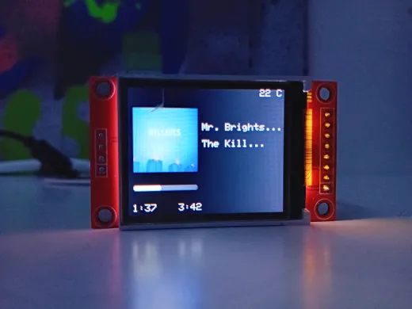
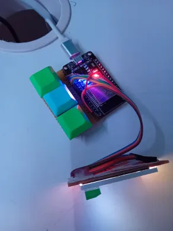

# 🎵 Spotify Controller with TFT Display 🎵

🚀 About This Project
This project is a minimalist Spotify controller featuring three physical buttons, a thermistor, and a 1.8-inch SPI TFT display (ST7735, 128x160). The display shows the current track info, and the buttons allow seamless music control.

🎛️ Features
1.8-inch TFT SPI Display (ST7735 128x160) to display track information.
Three buttons for:
Play/Pause ⏯️
Next Track ⏭️
Previous Track ⏮️
Thermistor 🌡️ to measure and display ambient temperature.
ESP32 Compatible
IFTTT or MQTT Support for Spotify communication.
🔧 Requirements
Microcontroller: ESP32 / ESP8266 (or another compatible MCU)
Display: 1.8-inch ST7735 SPI TFT (128x160 resolution)
Three physical buttons
Thermistor + resistors
Jumper wires & breadboard or PCB
🛠️ Installation
Clone the repository:
sh
Kopiëren
Bewerken
git clone https://github.com/koenll23/ESP32-Spotify-Controller.git  
Install required libraries in Arduino IDE:
WiFi.h
WiFiClientSecure.h
ArduinoJson
TJpegDecoder
HTTPClient (for API calls to Spotify/IFTTT)
SPI.h
TFT_eSPI
Update WiFi and Spotify info settings in codes.h.
Compile and upload the code to your ESP32.
🎶 How It Works
The system connects to WiFi on startup.
The display shows the current track.
Use the buttons to control music playback.
The thermistor measures temperature and displays it on the screen.
🔮 Future Improvements
Add volume control 🎚️
Enhanced UI with smooth animations 🎨
 > (I won't change anything on this project anymore. This will be your challenge. I would like to see your results! :D)

🤝 Contributing
Feel free to contribute! Fork the repo and submit a pull request with improvements.
---
Happy coding & enjoy your music! 🎧🔥
---

